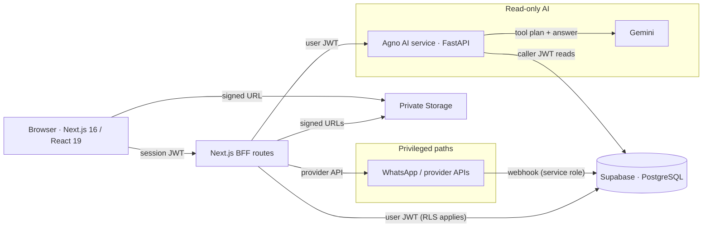
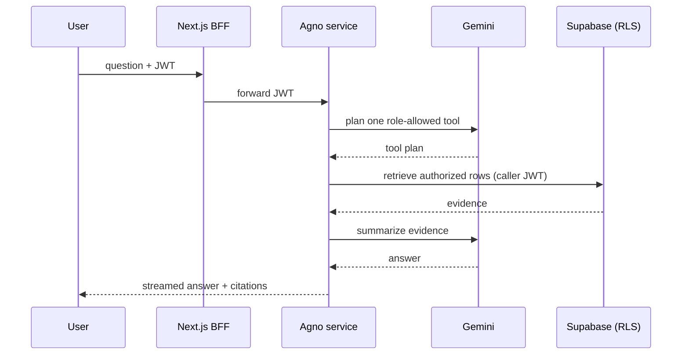
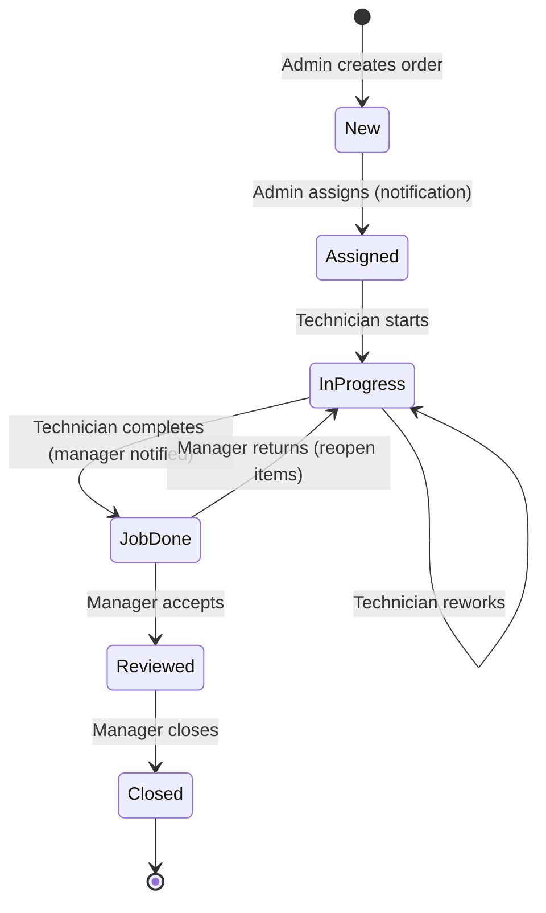

# Sejuk Sejuk Service Sdn Bhd

The Sejuk Sejuk Service Sdn Bhd operations platform is an end-to-end air-conditioning field-service application covering order intake, technician assignment and field work, manager review, payments, notifications, internal messaging, analytics, and a permission-scoped AI assistant.

## Architecture

```text
frontend/          Next.js 16, React 19, Tailwind CSS, authenticated BFF routes
backend/supabase/  PostgreSQL schema, RPCs, RLS, Realtime, Storage, seed and pgTAP tests
backend/agno/      FastAPI + Agno + Gemini read-only operations assistant
docs/              deployment, security and assessment documentation
openspec/          specifications and implementation history
```

The browser uses the authenticated Supabase client. RLS is the data boundary; lifecycle RPCs enforce roles, assignment, state, and optimistic order versions atomically. The browser never receives a service-role key. Operational realtime events are debounced into authoritative snapshot refreshes so different sessions converge on persisted state.

## Architecture diagrams







## Architecture decisions

- **RLS is the security boundary.** Every table enforces row-level security based on the caller's role, assignment, and ownership, so even a compromised browser session can only read what that user is allowed to see. The browser authenticates with the public anon key only; the service-role key exists server-side and is never shipped to the client.
- **All writes go through versioned, role-checked RPCs.** The UI never mutates tables directly. Each RPC re-verifies role, assignment, the order state machine, and an optimistic version number (raising `STALE_VERSION` on concurrent edits), then writes the change and its audit event in one transaction. This keeps workflow rules and traceability enforced in the database, not just the UI.
- **AI is server-side, read-only, and evidence-bound.** The assistant route forwards the signed-in JWT to Agno; Gemini plans exactly one role-allowed, read-only tool; the tool retrieves authorized rows through the caller's JWT (so RLS still applies); Gemini only summarizes that evidence. Analytical SQL is restricted to reviewed `assistant_analytics_*` views and validated by `sqlglot` (no writes/DDL, bounded joins/limits/timeouts). This satisfies "controlled queries, not unrestricted database access" while keeping the model out of the trust boundary.
- **Privileged access is confined.** The service-role key is used only where the caller cannot be trusted to read/write: document ingestion into private storage and provider webhook callbacks (e.g., WhatsApp status). Everything else runs as the signed-in user.
- **BFF routes keep secrets server-side.** Next.js API routes forward the user's session JWT to the Agno service and provider APIs; tokens and keys live only in server environment variables, never in the browser bundle.
- **Structured addresses with a composed display string.** Address parts are stored as columns for filtering/editing, then composed into a single display string, so existing single-line addresses and Google Maps links keep working.
- **Realtime converges on authoritative snapshots.** Live events are debounced and trigger full snapshot refreshes rather than optimistic patches, so different sessions and devices converge on persisted state after conflicts.
- **Private storage with signed URLs.** Evidence, receipts, and documents live in private buckets; the browser only ever receives short-lived signed URLs from an authenticated route, so files are never publicly readable.
- **Pluggable WhatsApp providers.** The deep-link handoff is the default (audited, delivery not claimed); delivery tracking is a provider interface (`console`, `meta`, future Twilio) so it stays inert until real credentials exist.
- **Testing at the right layers.** pgTAP tests role scope, RLS, and RPC behavior against the real database; Vitest/Testing Library cover repository hydration, mutations, and UI; Playwright covers role-based e2e workflows; Python pytest covers tool authorization and guards; CI runs all of it.

## Challenges / assumptions

**Challenges and how they were solved**

- **One authorization model across everything.** Field actions, payments, evidence, corrections, realtime, audit, and AI all had to respect the same role rules. Solved by making RLS the single boundary and putting every write behind role-checked, versioned RPCs, so the AI and the UI go through identical authorization.
- **Concurrent edits from multiple devices.** Optimistic versions raise `STALE_VERSION` on conflicts, and the UI surfaces a "refresh and try again" message instead of silently overwriting.
- **Private files that still need viewing.** Evidence, receipts, and documents are stored in private buckets and opened through short-lived signed URLs issued by an authenticated route.
- **Checklist proof never persisted.** Photos were only held in the browser. Fixed by uploading to storage and committing `job_evidence` rows linked to checklist items, including the missing database grants that had silently blocked inserts.
- **Audit history showed raw JSON or nothing.** Admin/manager events dumped JSON, and technicians saw a blank list. Fixed with a human-readable before/after diff formatter and a technician policy scoped to their own orders.
- **AI extraction reliability.** Extracted values are normalized deterministically (amounts like `RM 1,150.00` to `1150.00`, building numbers split from streets, payment-method variants mapped), and money-related actions are prefill-only so a human always confirms.
- **Truthful WhatsApp handling.** The app can't know if a `wa.me` message was delivered, so it audits only the "opened" event and never claims delivery; real delivery tracking is a ready-but-unconfigured provider template.
- **Permission gaps found during live testing.** Document ingestion needed service-role grants and creator visibility; technicians were scoped to ingest receipts for their own jobs only, while order-form extraction stayed admin/manager-only.

**Assumptions**

- The assessment explicitly allows a WhatsApp deep link, so Module 3 is satisfied without Meta delivery receipts; the template exists for later.
- AI never auto-commits orders or payments; it fills forms for review.
- Address parts are stored separately and composed into the display string; legacy single-line addresses remain valid.
- Technicians see only their own orders; order-form extraction is admin/manager-only; technicians may extract receipts for their own jobs.
- Receipts are stored both as extraction documents and as payment evidence linked to the payment record.
- The "AI workflow supervisor" alerts (price over quote, missing image evidence) are implemented as deterministic review warnings rather than AI-generated.
- Local development uses seeded demo identities with a shared assessment-only password; production should replace them.

## What I built

This is a complete field-service operations system for an air-conditioning company, following the assessment workflow: **order → assignment → service completion → notification → manager/accounts review → close → dashboard metrics**.

```text
  Admin            Technician               Technician              Manager               Manager
  create + assign  start & work            complete + notify      review                close
     │                  │                       │                     │                    │
     ▼                  ▼                       ▼                     ▼                    ▼
  ┌────────┐       ┌──────────┐           ┌──────────┐          ┌──────────┐        ┌────────┐
  │  New   │ ────▶ │ Assigned │ ────────▶ │In Progress│ ──────▶ │ Job Done │ ─────▶ │Reviewed│ ───▶ ┌────────┐
  └────────┘       └──────────┘           └──────────┘          └──────────┘        └────────┘      │ Closed │
       ▲                                                                                              └────────┘
       └── correction loop: Manager returns items → In Progress (technician reworks)
```

The application also ships an in-app **"How it works"** page (sidebar → Help) that explains the workflow, roles, AI features and architecture.

A standalone HTML project guide (workflow, roles, features, architecture, security, AI, assessment coverage, FAQ) is served at `/project-guide.html` and linked from the login page.

- **Order intake (Admin).** Admins create service orders with auto-generated numbers, a structured address form (building, lines, postcode, city, state), service type, quote, optional technician assignment, and notes. Orders persist through versioned Supabase RPCs, and a summary is shown after submission. Admins can re-edit the service details later, and the address links out to Google Maps. Key intake actions notify the assigned technician.
- **Assignment & field work (Technician).** Technicians get a role-scoped job queue. On the job they start/reschedule work, save checklist items with notes and photo proof, upload up to six pieces of private evidence, auto-calculate final amounts, record optional field payments, and complete the job. Completion notifies the manager and reveals a pre-filled WhatsApp feedback handoff for the customer.
- **Review & closure (Manager).** Managers see completion and correction queues, review checklist proof and payment status, accept or return selected work, and close reviewed orders. Deterministic warnings flag price-over-quote and missing image evidence.
- **Payments & receipts.** Admins collect outstanding payments with notes; the payment record can carry an attached receipt, and both admins and technicians can extract receipt fields with AI ("Extract from receipt") and attach the actual file to the payment.
- **Audit & traceability.** Every tracked action (creation, assignment, start, reschedule, completion, review, closure, payment, detail edits, WhatsApp opens) is recorded with actor, timestamp and before/after values, and rendered as a readable, role-scoped audit history.
- **Analytics.** Date-scoped KPI dashboard with completed jobs, service value, payments/outstanding, postponements, technician charts and a leaderboard.
- **AI assistant.** A read-only assistant answers operational questions from authorized, role-scoped data, including guarded analytical SQL and a workload tool that compares technicians against the team average. Document understanding extracts order and payment-receipt fields into prefillable forms.
- **WhatsApp.** User-activated `wa.me` deep links for assignment and feedback (audited, delivery not claimed), plus an optional plug-and-play provider template for real delivery receipts when Meta credentials are available.

## Tech stack used

**Frontend** — Next.js 16 (App Router + Turbopack), React 19, TypeScript, Tailwind CSS 4. Key libraries: `@supabase/ssr` + `@supabase/supabase-js` (sessions and data), `zod` (validation), `date-fns`/`date-fns-tz` (Kuala Lumpur time), `recharts` (charts), `lucide-react` (icons), `sonner` (toasts), `clsx` + `tailwind-merge`. Tests: Vitest + Testing Library, Playwright e2e.

**Backend / database** — Supabase: PostgreSQL 17, PostgREST (versioned RPCs), Row Level Security, Realtime, private Storage buckets, Auth. Schema is managed as versioned SQL migrations with a pgTAP test suite.

**AI service** — Python 3.12, FastAPI + Uvicorn, Agno 2.5 (tool planning), Google Gemini via `google-genai` (including strict JSON-schema extraction), `httpx` (caller-JWT Supabase REST), `sqlglot` (guarded analytical SQL), `pydantic`/`pydantic-settings`, `PyJWT` (token verification), `pypdf`/`python-docx` (document parsing). Quality gates: ruff, mypy, pytest.

**Tooling / CI** — npm workspaces, Docker Desktop (local Supabase), GitHub Actions `verify` workflow (ruff format/check, frontend lint/typecheck/test/build, database suite).

The stack matches the assessment's preferred tools (React, Tailwind, Supabase, Vercel-ready Next deployment) and keeps AI server-side behind strict authorization.

## How AI was integrated

AI lives entirely server-side in a separate FastAPI + Agno service (`backend/agno`); the browser only talks to a Next.js BFF route that forwards the signed-in user's JWT. That keeps model keys and database access out of the client and lets the database's RLS continue to scope every AI read to the caller.

- **Operations assistant.** The BFF streams the user's question with their JWT to Agno. Gemini plans exactly one role-allowed, read-only tool from a registry; the tool retrieves authorized rows through the caller's JWT; Gemini formats the answer from that evidence only and returns it with citations. Unsupported or write-style requests are declined, and every run is audited with a correlation id and safe metadata (never raw SQL, credentials, or returned rows).
- **Guarded analytical SQL.** For analytical questions, a query skill generates SQL that `sqlglot` validates (no writes/DDL, no system catalogs, only reviewed `assistant_analytics_*` views, bounded joins/nesting/limits/date ranges) and executes through a capped, timed RPC with the caller's JWT. Results are summarized by Gemini.
- **Document understanding (order intake).** Inside the New Order form, "Extract with AI" uploads a quotation/invoice/form (PDF, DOCX, TXT, MD, or photo); Gemini returns a strict JSON schema (customer, phone, address parts, service, details, amount, date) which is deterministically normalized and pre-filled into the form for human review before saving. The extraction is stored on the document record with confidence and audited.
- **Payment receipt extraction.** "Extract from receipt" in payment flows reads the receipt (amount, method, date, receipt number) and pre-fills the payment fields for both admins and technicians; the receipt file is also attached to the payment record as evidence.
- **Workload insight.** A dedicated read-only tool returns per-technician completed jobs and service value with the team average, so the assistant can answer "which technician might be overloaded this week?" by comparing real counts against the average.
- **Safety and limits.** A refusal layer blocks action keywords and prompt-injection patterns before any tool runs; the tool registry is role-filtered; the answer generator is instructed to treat evidence as data, never instructions, and to state only values present in authorized evidence.

## Implemented modules

- **Admin:** create orders with generated numbers, customize checklists, assign technicians, search/filter the queue, inspect audit history, and collect outstanding payments with notes and an attached receipt (AI-extracted and linked to the payment record).
- **Technician:** role-scoped job queue and dashboard, start/reschedule work, explicitly save checklist items and notes, upload private evidence, complete work, record field payment, and open a pre-filled customer feedback handoff.
- **Manager:** completion/correction queues, accept or return selected checklist work, close reviewed jobs, receive notifications, and view date-scoped KPI charts and leaderboards.
- **Organization:** direct/order conversations, announcements, mentions, notifications, read state, and realtime synchronization.
- **WhatsApp:** user-activated `wa.me` links for assignment and customer feedback. Feedback opening is audited with `delivery_confirmed=false`; the application never claims delivery.
- **AI:** authenticated, read-only Agno service using Gemini for tool planning and response formatting, controlled operational tools, an organization handbook, guarded analytical SQL over curated security-invoker views, and document understanding that extracts order fields (customer, service, amount, date) from uploaded PDF/DOCX/TXT/MD files with a Create-order prefill.

## WhatsApp delivery receipts (optional, plug-and-play)

Delivery confirmation is a provider-based template, not hard-wired. `WHATSAPP_PROVIDER` selects the implementation: `none` (disabled), `console` (logs locally for demos), or `meta` (WhatsApp Business Cloud API). Providers implement a small `send`/`verifyWebhook`/`parseDeliveryUpdate` interface, so a Twilio or other provider can be added the same way. When enabled, sent messages are recorded in `whatsapp_deliveries` and provider webhook callbacks upsert `sent`/`delivered`/`read`/`failed` status; the assignment panel shows a small delivery chip once a record exists. The Meta provider needs `WHATSAPP_ACCESS_TOKEN`, `WHATSAPP_PHONE_NUMBER_ID`, `WHATSAPP_VERIFY_TOKEN` and `WHATSAPP_APP_SECRET` from a Meta Business account — until then it stays inert, and the `wa.me` deep link remains the active path. Webhook POSTs are protected: the endpoint verifies Meta's `X-Hub-Signature-256` HMAC over the raw request body and rejects unsigned or tampered callbacks with `401`.

## Security posture

- **Dependencies are pinned and audited.** Python runtime pins live in `backend/agno/requirements.txt` (dev tools in `requirements-dev.txt`), mirroring `pyproject.toml`; the frontend is pinned via `package-lock.json`. `pip-audit` shows no exploitable runtime advisories.
- **Webhook signatures verified.** The WhatsApp webhook requires a valid `X-Hub-Signature-256` (HMAC-SHA256 with `WHATSAPP_APP_SECRET`, compared in constant time) and fails closed.
- **Security headers on every response.** Content-Security-Policy (scoped to the Supabase origin), `X-Frame-Options: DENY`, `X-Content-Type-Options: nosniff`, `Referrer-Policy`, `Permissions-Policy`, and HSTS in production.
- **Upload parsing is bounded.** Documents are capped at 25 MB at intake, and DOCX archives are checked for oversized/expanded entries before any decompression (zip-bomb guard).
- **Secrets stay server-side.** Service-role and model keys exist only in server environment variables; `.env.*` files are gitignored except the committed `.env.example` templates.
- **Reproducible builds.** `uv.lock` and `requirements*.txt` keep the Agno environment reproducible; CI installs the pinned dev requirements and the package itself.
## Local setup

Requirements: Node.js 20.19+, npm, Docker Desktop, Python 3.10+, and the Supabase CLI (the commands below can use `npx`).

```powershell
npm install
npx supabase start --workdir backend
npx supabase db reset --workdir backend
Copy-Item frontend/.env.example frontend/.env.local
npm run dev --workspace @sejuk/frontend
```

Set these local frontend values:

```dotenv
NEXT_PUBLIC_SUPABASE_URL=http://127.0.0.1:54321
NEXT_PUBLIC_SUPABASE_ANON_KEY=<ANON_KEY from npx supabase status --workdir backend>
NEXT_PUBLIC_DEMO_MODE=false
NEXT_PUBLIC_DEMO_ACCOUNT_PASSWORD=SejukDemo2026!
AGNO_ASSISTANT_URL=http://127.0.0.1:8000
AGNO_ASSISTANT_ENABLED=true
```

For the AI service:

```powershell
cd backend/agno
python -m venv .venv
.venv\Scripts\Activate.ps1
python -m pip install -e ".[dev]"
# or, for pinned installs without editable package metadata:
# python -m pip install -r requirements-dev.txt
# python -m pip install -e .
Copy-Item .env.example .env
uvicorn sejuk_assistant.main:app --reload --port 8000
```

Configure the Agno `.env` with the local Supabase URL/public key, Gemini API key/model, and `SEJUK_QUERY_SKILL_ENABLED=true`. The seeded local identities are Nadia (Admin), Farah (Manager), and technicians Ali, John, Bala, and Yusoff. `SejukDemo2026!` is assessment-only and must not be reused.

Set `NEXT_PUBLIC_DEMO_MODE=true` only for the isolated browser-local demonstration. In Supabase mode, failed shared loading is shown with retry and never replaced by seeded localStorage data.

## AI behavior and security

The Next.js assistant route forwards the signed-in user's JWT to Agno. Gemini selects one role-allowed, read-only tool; the tool retrieves authorized evidence; Gemini summarizes that evidence. Available subjects include orders, payments, performance, postponements, staff, permitted messages, reviews/audits, handbook guidance, documents, and analytical questions. Workload questions ("which technician might be overloaded this week?") use a dedicated read-only tool that returns per-technician completed-job counts and service value alongside the team average, so the assistant compares against the average from real data.

Analytical SQL is generated only against reviewed `assistant_analytics_*` views. `sqlglot` rejects writes/DDL, multiple statements, system catalogs, unapproved relations/functions, `SELECT *`, excessive joins/nesting, large limits, and overlong date ranges. Execution uses the caller JWT through a capped, timed RPC; underlying RLS continues to scope technicians to their own work. Audits retain fingerprints and safe metadata, not raw SQL literals, credentials, or returned rows. Casual conversation is supported; unrelated subjects such as sports or homework are declined.

Document retrieval exists but is not required for handbook guidance. The operational handbook is a reviewed Markdown knowledge source, not RAG. The assistant is read-only and cannot change workflows or payments.

Document understanding is a prefill-only flow: an uploaded quotation, invoice, receipt, work order or client form is read by Gemini with a strict JSON schema, and the extracted fields are saved to the document version record (with confidence) and audited. It is available inside the New Order form via the highlighted "Extract with AI" button (fills customer, phone, address parts, service, details, amount and date for review), and inside payment recording via "Extract from receipt" for both admins and field technicians (fills amount and method). Supported uploads are PDF, DOCX, TXT, Markdown and photos (JPG/PNG/WebP) up to 25 MB.

## Verification

```powershell
npx supabase db reset --workdir backend
npx supabase test db --workdir backend
npm run lint --workspace @sejuk/frontend
npm run typecheck --workspace @sejuk/frontend
npm run test --workspace @sejuk/frontend
npm run build --workspace @sejuk/frontend
cd backend/agno
python -m pytest
```

The database suite covers role scope, lifecycle transitions, manager correction, reopened work, payments/notes, notification reads, realtime publication, and truthful WhatsApp audit state. Frontend tests cover repository hydration/mutations/conflicts/subscriptions and UI behavior.

## If I had to explain one module

Order intake is the module I would start with, because every other feature hangs off it. The order is a versioned row whose state machine (New → Assigned → In Progress → Job Done → Reviewed → Closed) is enforced by RPCs, not the UI: each transition checks the caller's role, the assignment, the current state, and an optimistic version, then writes the change and an audit event in one transaction. That single pattern then carries through the whole system — technician completion, manager review, payments, reschedules — so the same authorization and traceability rules apply everywhere. The AI extraction (upload a quotation → form pre-filled) is layered on top without changing that core: it only feeds the intake form, and the order is still created through the same validated RPC.

## Hosted promotion

Apply the same checked-in migrations to hosted Supabase, create production Auth/profile records, configure private Storage and redirect URLs, and replace only the public Supabase URL/key environment values. Keep `NEXT_PUBLIC_DEMO_MODE=false`. Workflow code and the browser security model do not change. Deploy the frontend and Agno service separately and point `AGNO_ASSISTANT_URL` to the private service endpoint.

## Submission guide (assessment README)

**What I built** — An end-to-end air-conditioning field-service operations platform covering the full order-to-review workflow (see the "What I built" section above): admin order intake with structured addresses and AI-assisted extraction, technician field work with checklist proof and payments, manager review/closure with KPI dashboards, notifications and messaging, WhatsApp handoffs, and a permission-scoped, read-only AI assistant.

**Tech stack used** — React 19 + Next.js 16 + Tailwind CSS on the frontend, Supabase (PostgreSQL, RLS, Realtime, Storage, Auth) for the backend, and FastAPI + Agno + Gemini for the AI service (full dependency details in the "Tech stack used" section above). The frontend and AI service deploy separately.

**Architecture decisions** — RLS as the security boundary, versioned role-checked RPCs with optimistic concurrency for every write, read-only evidence-bound AI, confined service-role usage, BFF routes for secrets, and pluggable providers (see the "Architecture decisions" section above for the full rationale).

**Challenges / assumptions** — The hard parts were keeping one authorization model across field actions, payments, evidence, corrections, realtime, audit, and AI; optimistic concurrency across devices; private-file viewing; and making AI extraction reliable and prefill-only. Key assumptions: the assessment allows a WhatsApp deep link (delivery receipts are a ready template), AI never auto-commits money actions, structured address parts compose into the display string, and deterministic review warnings stand in for an AI workflow supervisor (see the "Challenges / assumptions" section above).

**How AI was integrated** — AI runs server-side in an Agno service behind a JWT-authenticated BFF: Gemini plans one role-allowed, read-only tool, retrieves authorized evidence through the caller's JWT, and formats the answer; analytical SQL is validated against reviewed views; document and receipt extraction use strict JSON schemas with deterministic normalization and prefill-only forms; a workload tool compares technicians to the team average (see the "How AI was integrated" section above).

**What limitations exist** — `wa.me` confirms only that the handoff was opened (delivery tracking is a ready-but-unconfigured template). No offline field drafts. Local seeded credentials; production should use SSO/MFA. Evidence needs retention/malware-scanning policies. Hosting is documented but not yet deployed.

**AI queries supported** — Operational lookups (orders, payments, performance), workload comparisons, postponements, staff directory, accessible messages, reviews/audits, the organization handbook, authorized documents, guarded analytical questions, and document/receipt extraction. Casual conversation is supported; unrelated or write requests are declined.

**Limitations of the AI implementation** — Read-only by design; it cannot create, edit or delete records. Extraction quality depends on document legibility, and analytical queries are bounded to reviewed views, capped execution time, and safe metadata-only auditing.

## Limitations and production improvements

- `wa.me` confirms only that the handoff was opened. Confirmed delivery requires WhatsApp Business consent, provider webhooks, and message-status storage.
- Local assessment identity cards use shared seeded credentials; production should use workforce SSO/MFA and derive the directory entirely from profiles.
- Field drafts are not offline-capable; weak-connectivity deployments should add encrypted local drafts and conflict-aware upload retry.
- Evidence is private and signed, but production needs retention, malware scanning, and lifecycle policies.
- AI quality depends on Gemini availability and the reviewed semantic profile. It cannot answer outside authorized evidence and intentionally cannot write data.

## Assessment reflection

Order intake was the most direct module. The difficult work was keeping mobile field actions, payments, evidence, review corrections, realtime sessions, auditability, and AI queries consistent under one authorization model. AI tools helped structure requirements and implementation, while application AI remains deliberately read-only and evidence-bound.

See [docs/assessment-status.md](docs/assessment-status.md) and [docs/deployment.md](docs/deployment.md).
